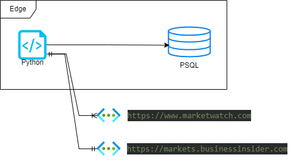

# Stock sniffer

Stock sniffer is python script to monitor specified stocks in config/db table. Obtaining price every minute it saved to psql db.

## Model
*Tables*

## Configuration file
*Config params*

## Diagram

